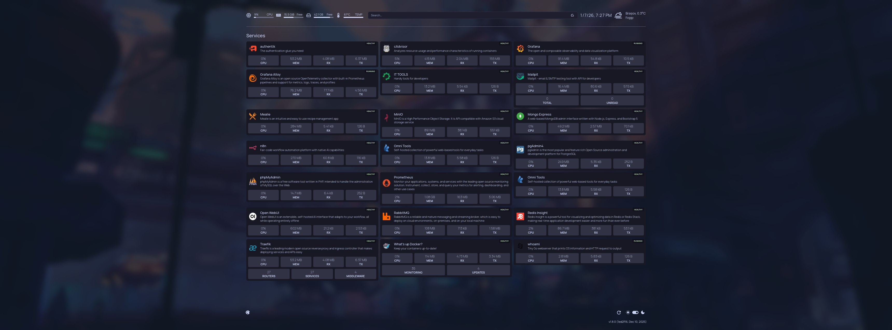

# Docker dashboard



Background by [Viktor Hanacek](https://picjumbo.com/author/viktorhanacek/) from [picjumbo.com](picjumbo.com)

## Table of Contents

- [About this project](#about-this-project)
- [Installation](#installation)
- [List of available services](#list-of-available-services)
- [Import Bitwarden secrets](#import-bitwarden-secrets)
- [Development](#development)

## About this project

This project is a comprehensive Docker-based developer dashboard designed to streamline and enhance your development workflow. It bundles a curated set of essential services and tools—ranging from container monitoring and database management to email testing and customizable start pages—all orchestrated with Docker Compose for easy setup and maintenance.

Whether you want to keep tabs on your running containers with cAdvisor, manage databases using pgAdmin or phpMyAdmin, explore APIs via the homepage dashboard, or test email workflows with Mailpit, this project brings them together in a unified, self-hosted environment.

Built with flexibility and productivity in mind, it helps developers quickly spin up a local ecosystem that covers common development needs without clutter or tracking—just fast, accessible tools running right on your machine.

## Installation

Before running the install script make sure [mkcert](https://github.com/FiloSottile/mkcert?tab=readme-ov-file#linux) is installed.

```bash
./install.sh
```

## List of available services

- [cAdvisor](https://cadvisor.localdev): Analyzes resource usage and performance characteristics of running containers
  - [Docker Hub](https://hub.docker.com/r/google/cadvisor)
  - [Dockerfile](https://github.com/google/cadvisor/blob/master/deploy/Dockerfile)
- [homepage](https://homepage.localdev): A highly customizable homepage (or startpage / application dashboard) with Docker and service API integrations
  - [Docker Hub](https://hub.docker.com/r/gethomepage/homepage)
  - [Dockerfile](https://github.com/gethomepage/homepage/blob/dev/Dockerfile)
- [IT - TOOLS](https://it-tools.localdev): Collection of handy online tools for developers, with great UX
  - [Docker Hub](https://hub.docker.com/r/corentinth/it-tools)
  - [Dockerfile](https://github.com/CorentinTh/it-tools/blob/main/Dockerfile)
- [Mailpit](https://mailpit.localdev): An email and SMTP testing tool with API for developers
  - [Docker Hub](https://hub.docker.com/r/axllent/mailpit)
  - [Dockerfile](https://github.com/axllent/mailpit/blob/master/Dockerfile)
- [MinIO](https://minio.localdev): MinIO is a high-performance, S3 compatible object store, open sourced under GNU AGPLv3 license
  - [Docker Hub](https://hub.docker.com/r/minio/minio)
  - [Dockerfile](https://github.com/minio/minio/blob/master/Dockerfile)
- [MongoDB](null): MongoDB is a document database with the scalability and flexibility that you want with the querying and indexing that you need
  - [Docker Hub](https://hub.docker.com/_/mongo)
  - [Dockerfile](https://github.com/docker-library/mongo/blob/master/8.0/Dockerfile)
- [MySQL](null): MySQL is the world's most popular open source database
  - [Docker Hub](https://hub.docker.com/_/mysql)
  - [Dockerfile](https://github.com/docker-library/mysql/blob/master/innovation/Dockerfile.oracle)
- [nginx-proxy](null): Automated Nginx reverse proxy for docker containers
  - [Docker Hub](https://hub.docker.com/r/jwilder/nginx-proxy)
  - [Dockerfile](https://github.com/nginx-proxy/nginx-proxy/blob/main/Dockerfile.debian)
- [Omni Tools](https://omni-tools.localdev): Self-hosted collection of powerful web-based tools for everyday tasks. No ads, no tracking, just fast, accessible utilities right from your browser!
  - [Docker Hub](https://hub.docker.com/r/iib0011/omni-tools)
  - [Dockerfile](https://github.com/iib0011/omni-tools/blob/main/Dockerfile)
- [PostgreSQL](null): PostgreSQL is a powerful, open source object-relational database system with over 35 years of active development that has earned it a strong reputation for reliability, feature robustness, and performance
  - [Docker Hub](https://hub.docker.com/_/postgres)
  - [Dockerfile](https://github.com/docker-library/postgres/blob/master/17/bookworm/Dockerfile)
- [prometheus](https://prometheus.localdev): Monitor your applications, systems, and services with the leading open source monitoring solution. Instrument, collect, store, and query your metrics for alerting, dashboarding, and other use cases
  - [Docker Hub](https://hub.docker.com/r/prom/prometheus)
  - [Dockerfile](https://github.com/prometheus/prometheus/blob/main/Dockerfile)
- [RabbitMQ](https://rabbitmq.localdev): RabbitMQ is a reliable and mature messaging and streaming broker, which is easy to deploy on cloud environments, on-premises, and on your local machine. It is currently used by millions worldwide
  - [Docker Hub](https://hub.docker.com/_/rabbitmq)
  - [Dockerfile](https://github.com/docker-library/rabbitmq/blob/master/4.0/alpine/Dockerfile)
- [Redis](null): Redis is the world's fastest in-memory database
  - [Docker Hub](https://hub.docker.com/_/redis)
  - [Dockerfile](https://github.com/redis/docker-library-redis/blob/master/7.4/alpine/Dockerfile)
- [What's up Docker?](https://whatsupdocker.localdev): Keep your containers up-to-date!
  - [Docker Hub](https://hub.docker.com/r/getwud/wud)
  - [Dockerfile](https://github.com/getwud/wud/blob/main/Dockerfile)

## Import Bitwarden secrets

```bash
./scripts/secrets.sh bitwarden@mail.com
```

## Development

```bash
npm i
```
